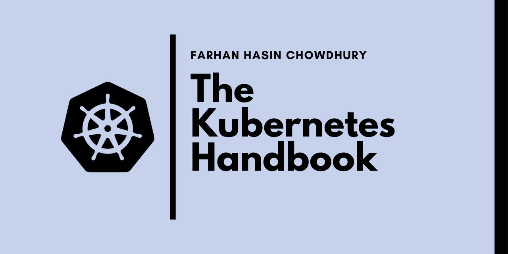

# Kubernetes Handbook Projects

| :bell: NOTIFICATION |
|:--------------------|
| This branch contains the complete versions of the projects. If you want the incomplete ones, please check the [master](https://github.com/fhsinchy/kubernetes-handbook-projects/tree/master/) branch. |

This repository holds the code for my Kubernetes Handbook article on [__freeCodecamp__](https://freecodecamp.org). In the article the readers work through __three__ projects with increasing complexity. These projects are as follows:

- hello-kube - A single container Vue application.
- notes-api - A multi container Express API.
- fullstack-notes-application - A full-stack CRUD application with [nginx](https://hub.docker.com/_/nginx/) as a reverse proxy.

## Prerequisites

- Familiarity with JavaScript.
- Familiarity with the Linux Terminal.
- Familiarity with Docker (suggested read: [The Docker Handbook](https://www.freecodecamp.org/news/the-docker-handbook/)).

It's fine if you haven't worked with JavaScript that much. Having a basic knowledge of executing scripts with `npm` will suffice.
